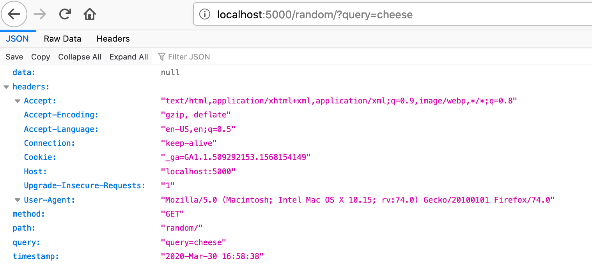

# Echo

Simple application that returns and logs data about the request it receives.


| Browser request | Postman request |
| ----  | --- |
|  |  |

## Problem

I'm creating a webhook for a third party application to call. Problem: That application has no documentation, I have no clue what they will send me.


## Solution
This application accepts GET and POST on all paths, and logs its path, headers and data.


## Deploy

[](https://heroku.com/deploy)

### Deploy locally
```
# Install python 3.8
pyenv install

# Setup local environment
$(pyenv which python) -m venv .venv
source .venv/bin/activate
 
# Install requirements
pip install -r requirements.txt

# Run server
gunicorn app:app
```

## See logs
Requests are printed directly in the console. If the app is on Heroku, it can be retrieved with 
```
heroku logs -t -a MY_HEROKU_APP_NAME 
```
